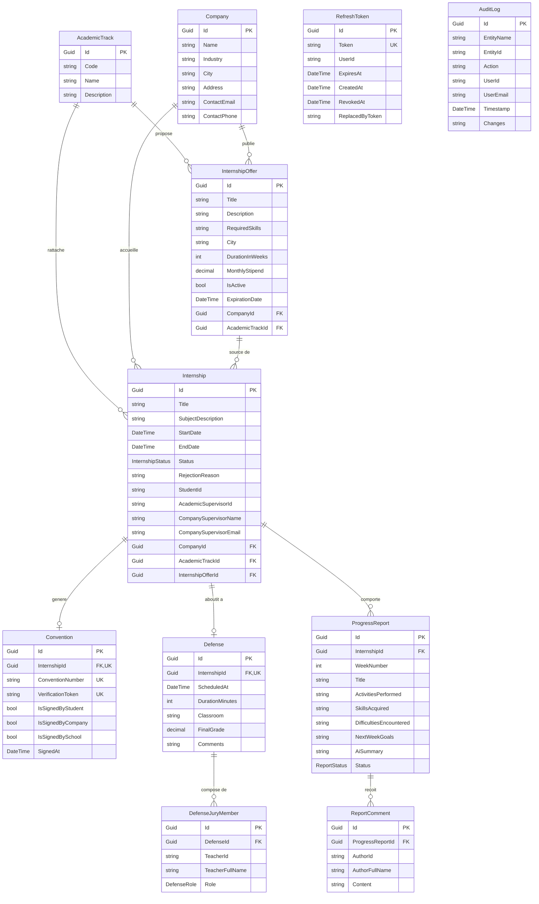

# Modèle de Données E-R StageFlow

Diagramme relationnel Mermaid représentant la totalité des entités du domaine, leurs cardinalités, clés étrangères et propriétés directes.

```mermaid
erDiagram
    AcademicTrack ||--o{ InternshipOffer : "propose"
    AcademicTrack ||--o{ Internship : "rattache"
    
    Company ||--o{ InternshipOffer : "publie"
    Company ||--o{ Internship : "accueille"
    
    InternshipOffer ||--o{ Internship : "source de"
    
    Internship ||--o| Convention : "genere"
    Internship ||--o| Defense : "aboutit a"
    Internship ||--o{ ProgressReport : "comporte"
    
    ProgressReport ||--o{ ReportComment : "recoit"
    Defense ||--o{ DefenseJuryMember : "compose de"

    AcademicTrack {
        Guid Id PK
        string Code
        string Name
        string Description
    }

    Company {
        Guid Id PK
        string Name
        string Industry
        string City
        string Address
        string ContactEmail
        string ContactPhone
    }

    InternshipOffer {
        Guid Id PK
        string Title
        string Description
        string RequiredSkills
        string City
        int DurationInWeeks
        decimal MonthlyStipend
        bool IsActive
        DateTime ExpirationDate
        Guid CompanyId FK
        Guid AcademicTrackId FK
    }

    Internship {
        Guid Id PK
        string Title
        string SubjectDescription
        DateTime StartDate
        DateTime EndDate
        InternshipStatus Status
        string RejectionReason
        string StudentId
        string AcademicSupervisorId
        string CompanySupervisorName
        string CompanySupervisorEmail
        Guid CompanyId FK
        Guid AcademicTrackId FK
        Guid InternshipOfferId FK
    }

    Convention {
        Guid Id PK
        Guid InternshipId FK, UK
        string ConventionNumber UK
        string VerificationToken UK
        bool IsSignedByStudent
        bool IsSignedByCompany
        bool IsSignedBySchool
        DateTime SignedAt
    }

    ProgressReport {
        Guid Id PK
        Guid InternshipId FK
        int WeekNumber
        string Title
        string ActivitiesPerformed
        string SkillsAcquired
        string DifficultiesEncountered
        string NextWeekGoals
        string AiSummary
        ReportStatus Status
    }

    ReportComment {
        Guid Id PK
        Guid ProgressReportId FK
        string AuthorId
        string AuthorFullName
        string Content
    }

    Defense {
        Guid Id PK
        Guid InternshipId FK, UK
        DateTime ScheduledAt
        int DurationMinutes
        string Classroom
        decimal FinalGrade
        string Comments
    }

    DefenseJuryMember {
        Guid Id PK
        Guid DefenseId FK
        string TeacherId
        string TeacherFullName
        DefenseRole Role
    }

    RefreshToken {
        Guid Id PK
        string Token UK
        string UserId
        DateTime ExpiresAt
        DateTime CreatedAt
        DateTime RevokedAt
        string ReplacedByToken
    }

    AuditLog {
        Guid Id PK
        string EntityName
        string EntityId
        string Action
        string UserId
        string UserEmail
        DateTime Timestamp
        string Changes
    }
```

